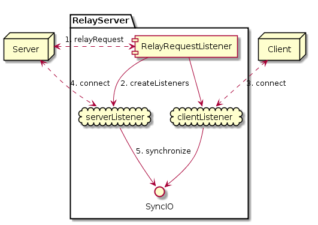

## Relay Server
Suppose you have two programs that can talk to a relay computer via TCP, but
can not reach each other (because of NAT or firewall issues). What do you do?
You come to this wonderful repo and use our wonderful RelayServer!

Our relayServer accepts requests from servers that want all their
traffic sent through it. To use the relay server:

    ./relayServer <port>
    ./serverPorgram <relayHost> <relayPort>

This will show a message like the following:

    2017/10/14 11:23:17 Serving relay requests on port 62514
    
At this point, all your clients can connect to the relayPort on port 62514.

Please see section [connecting your server](Connecting your server) for instructions
on how to connect servers to `relayServer`.

## Architecture
The following diagram shows what happens when a new `relayRequest` is made:

The dotted lines represent TCP connections. The solid ones, actions. Clouds represent
tcp servers.

1. A `server` sends the `relayServer` a request to have its traffic relayed. This
   connection is kept open to notify the `server` when a new `client` has connected.
2. The `relayServer` receives the request and creates 2 tcp Servers: one to receive
   connections from `client`s and one to receive connections from `server`s. The
   relay server advertises the port that clients of the server can connect to.
3. A `client` connects to the `relayServer`. The `relayServer` uses the connection
   established in 1 to notify the `server` that a new connection has been made.
4. The `server` connects to the `relayServer`.
5. As there is now a connection with both the `client` and the `server`, the
   `relayServer` synchronizes I/O between them, making sure every byte that is
   written on any one end is also passed to the other.

As mentioned above, when a `client` connects to the `relayServer`, we notify the
`server` by sending a string. This string contains has the prefix `[NEW]` followed
 by the the port and is ended with the `\n` character. `server`s using
 `relayServer` read this message from the connection stream established when they first connected to the `relayServer`.

## Connecting your server
As we don't want our `relayServer` to initiate any connections, but to receive
them, we start sockets and wait for all interested parties to connect to us instead
of trying to connect to them.

In the client/server architecture, clients connect to servers, hence servers
have *incoming* connections from the clients. Accepting a client that
wants to connect using the `relayServer` requires servers themselves to
initiate the connection.

In order for servers to keep their logic unmodified, we suggest the following
procedure when receiving clients from the `relayServer`:

Start the `server` as you would normally (it could be a local interface). Connect
to the `relayServer`. When notified of a new client connection, create 2 tcp
sockets: One to the `relayServer` on the host/port specified in the message 
and one to the `server`. Then synchronize these 2 connections.

We have come up with 2 examples of a simple echo server and a simple web server
that use this method:

[echoServer.go](examples/echoserver.go)

[webServer.go](examples/webserver.go)

